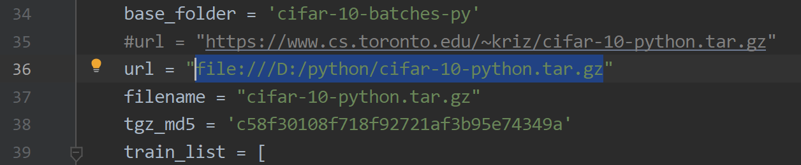
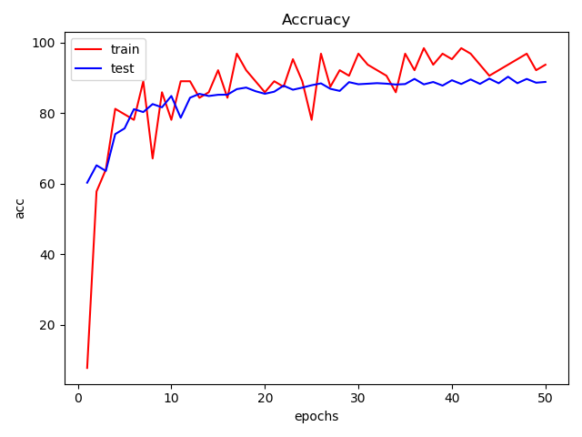

# DenseNet
Reimplementation DenseNet on cifar10 with pytorch

https://arxiv.org/pdf/1608.06993.pdf

pytorch 1.4.0      

torchvision 0.5.0     

numpy1.16.5  

# How to use

1、Do not download cifar10 from https://www.cs.toronto.edu/~kriz/cifar-10-python.tar.gz. The speed is too slow. Use BaiduNetdisk

2、Change the source code of cifar.py

you should use your own filepath

3、run main.py

# Result

After 50 epochs, the best accuracy on testset is 90.34% and average loss is 0.3153.

the Accuracy-Epoch graph is as follows

